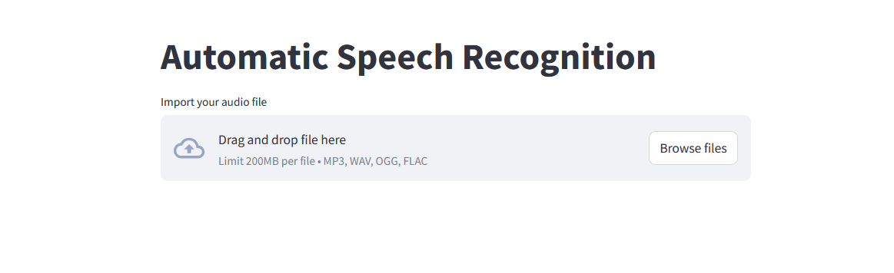
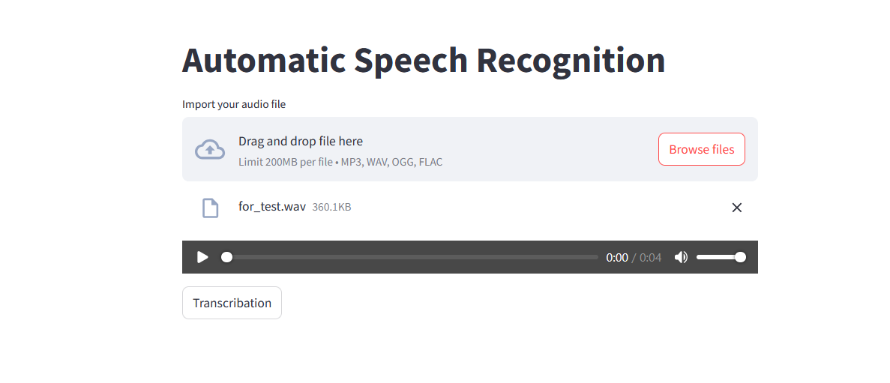
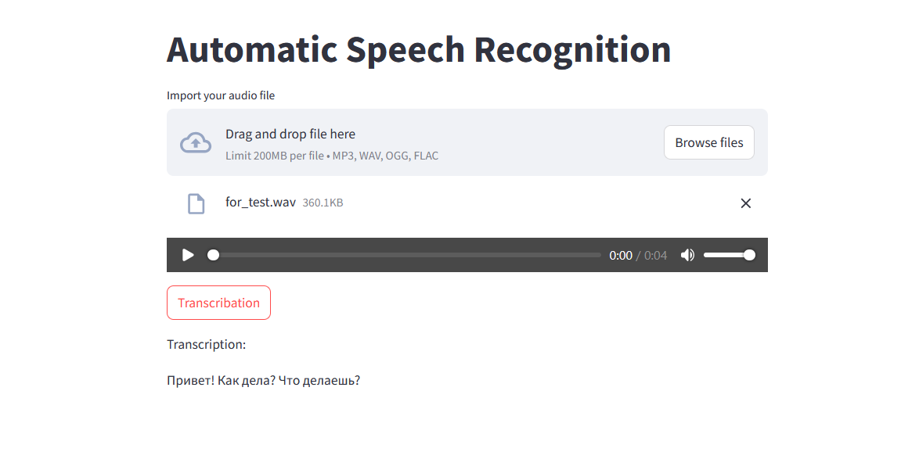

# Audio Transcription Service

This project implements an audio transcription service using the [openai/whisper-large-v3-turbo](https://huggingface.co/openai/whisper-large-v3-turbo) model from Hugging Face. It provides both a Streamlit web interface and a FastAPI API for transcribing audio files.

## Features

*   **Audio Transcription:** Transcribes audio files using the Whisper model.
*   **Streamlit Interface:** Provides a user-friendly web interface for uploading and transcribing audio.
*   **FastAPI API:** Offers an API endpoint for programmatic access to the transcription service.
*   **Dockerized:** Packaged in a Docker container for easy deployment and portability.

## Technologies Used

*   [openai/whisper-large-v3-turbo](https://huggingface.co/openai/whisper-large-v3-turbo): A powerful speech-to-text model.
*   [Hugging Face Transformers](https://huggingface.co/transformers/): A library for using pre-trained models.
*   [Streamlit](https://streamlit.io/): A framework for building web applications.
*   [FastAPI](https://fastapi.tiangolo.com/): A modern, high-performance web framework.
*   [Docker](https://www.docker.com/): A platform for containerizing applications.

## Prerequisites

*   [Docker](https://docs.docker.com/get-docker/) installed on your system.

## Screenshots







## Installation

1.  Make sure Docker and Docker Compose are installed on your server.

2.  Ensure that the `make` command is installed in your system's environment variables.  If you haven't installed `make` yet, follow these instructions:

    *   **For Windows:** Follow the instructions on this website: [https://www.thewindowsclub.com/install-and-run-makefile-on-windows](https://www.thewindowsclub.com/install-and-run-makefile-on-windows).  This usually involves installing MinGW or a similar toolchain, and then adding the directory containing `make` (usually `C:\MinGW\bin` or similar) to your system's `PATH` environment variable.
    *   **For macOS and Linux:** `make` is typically pre-installed or easily installed using your system's package manager (e.g., `apt install make` on Debian/Ubuntu, `brew install make` on macOS).

2.  Clone the repository:

    ```bash
    git clone https://github.com/Alatin-sergey/hash_project.git
    cd hash_project
    ```

3. Ensure that Docker Desktop is running on your system. 

4.  Run the project using `make -f makefile`. Note that the initial Docker image creation may take up to an hour due to library downloads and tensor processing.

    ```bash
    make -f makefile
    ```

5.  Open the Streamlit application in your browser at `http://localhost:8501`. This port is used for the user interface.
    Access the FastAPI API at `http://localhost:8000`. This port is used for the backend API.

6. To stop makefile use:

    ```bash
    make -f makefile down
    ```
    

7. To clean server from Docker Desktop:
   
    ```bash
    make -f makefile clean
    ```
    
    **Warning:** This command will remove all unused Docker images and volumes. Be careful when using it.

### Endpoint: `/api/transcribe`

*   **Method:** `POST`
*   **Description:** Transcribes an audio file.
*   **Request Body:**

    *   `file`: Audio file to transcribe (e.g., `.wav`, `.mp3`).

*   **Response Body:**

    ```json
    {
      "transcription": "The transcribed text."
    }
    ```

*   **Example Request (using `curl`):**

    ```bash
    curl -X POST -F "file=@audio.wav" http://localhost:8000/api/transcribe
    ```

## License

See the [LICENSE](LICENSE) file for details.

## Acknowledgments

*   This project uses the [openai/whisper-large-v3-turbo](https://huggingface.co/openai/whisper-large-v3-turbo) model, which is licensed under its respective license.
*   Thanks to the Hugging Face team for providing the Transformers library.